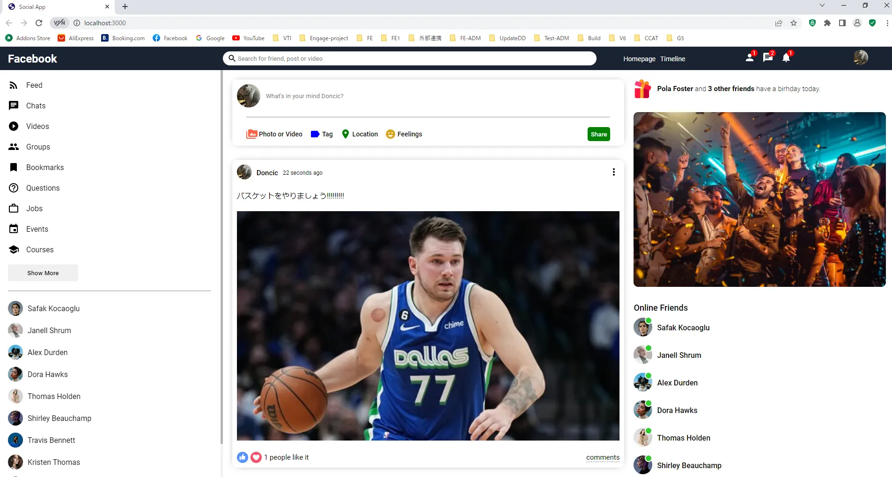

# Social-Network

Project for social network by NodeJs and ReactJs


## Build Project

1.Build server

```bash
  cd api
  yarn install
  yarn start
  #do not forget to create .env before yarn start
```
2.Build client

```bash
  cd client
  yarn install
  yarn start
  #Run on http://localhost:3000/
```


## Demo




## 🚀 About Me
I'm a full stack developer for 4 years

